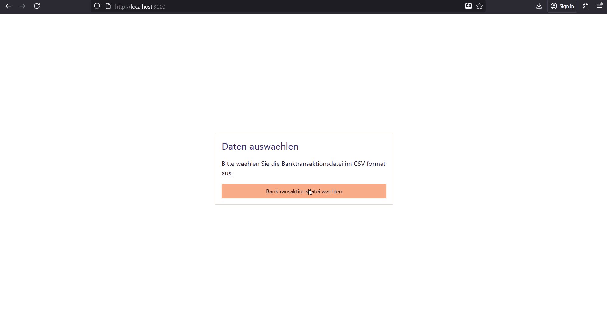

# Finanzen

Diese Projekt soll Menschen helfen mit moeglichst geringen Aufwand und maximaler Sicherheit Ihre Finanzen im Ueberblick zu halten.

## Eigentschaften

- **German-First**:
  - priorisiert deutschsprachige Menschen
  - Verarbeitung von Volksbank und Sparkassen CSV export Daten
- **Exportierte Bankdaten nur lokal**:
  - Banddaten z.b. Transaktionsdaten werden ausschliesslich temporaer im Browser cache gehalten
- **Einfache in Betriebnahme**:
  - Persistierung erfolgt absichtlich, ausschliesslich mit Lokalen JSON files

## In Betriebnahme

- Node: <https://nodejs.org/en/download>
- Runterladen das aktuellsten builds <https://github.com/Trenrod/Finanzen/releases>
- Endpacken
- Starten mit `node server/index.mjs`

## Benutzung

### Domain Storytelling

Source: [Egon](<docs/Finanzen App_2025-11-02.egn>)

### Demo

## Meilensteine

Zu den vorherigen releases siehe release notes

### Weg zu 1.0.0

- [x] Dokumentation
- [x] Benutzerdefinierte Kategorien
- [x] Farbe fixen
- [x] Benutzerdefinierter Pfad fuer alle backend daten
- [ ] Sparkassen Export CSV

### Weg zu 1.1.0

- [ ] Tests
  - [ ] Volksbank CSV
  - [ ] Sparkasse CSV
  - [ ] Kommentar JSON
  - [ ] Regeln JSON

### Weg zu 2.0.0

- [ ] Multi mandantenfaehigkeit TBD

### Weg zu 3.0.0

- [ ] Lokalisierungen english TBD
- [ ] English README.md
